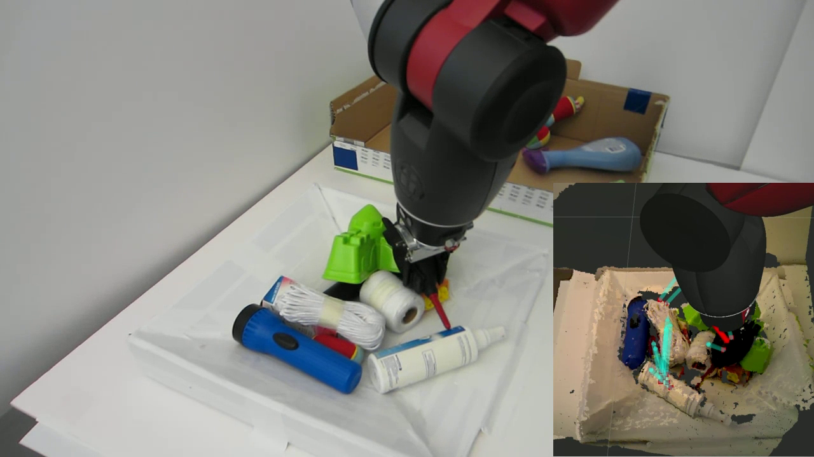
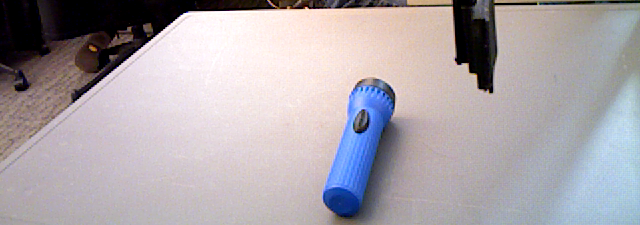

# agile_grasp

* **Author:** Andreas ten Pas (atp@ccs.neu.edu)
* **Version:** 1.0.0
* **ROS Wiki page:** [http://wiki.ros.org/agile_grasp](http://wiki.ros.org/agile_grasp)
* **Author's website:** [http://www.ccs.neu.edu/home/atp/](http://www.ccs.neu.edu/home/atp/)


## 1) Overview
This package localizes antipodal grasps in 3D point clouds. **AGILE** stands for **A**ntipodal **G**rasp **I**dentification and **LE**arning.
<!--
The video below shows the Baxter robot localizing and 
grasping objects in dense clutter, and explains our method.
-->

<a href="./readme/vlc0.png"></a>
	
This package consists of two command line tools and one ROS node:

1. **train_svm:** (command line tool) Train an SVM to localize grasps in point clouds
2. **test_svm:** (command line tool) Localize grasps in a *.pcd* file using a trained SVM
3. **find_grasps:** (ROS node) Localize grasps in a point cloud obtained from a range sensor


## 2) Requirements
1. [ROS Hydro](http://wiki.ros.org/hydro) or [ROS Indigo](http://wiki.ros.org/indigo)
2. [Lapack](http://www.netlib.org/lapack/) (install in Ubuntu: $ sudo apt-get install liblapack-dev)
3. [OpenNI](http://wiki.ros.org/openni_launch) or a similar range sensor driver


## 3) Installation

### From Source, ROS Indigo
1. Open a terminal
2. Navigate to the *src* folder of your ROS workspace: `$ cd location_of_workspace/src`
2. Clone the repository: `$ git clone http://wiki.ros.org/agile_grasp.git`
3. Navigate back to the root of your ROS workspace: `$ cd ..`
4. Recompile your ROS workspace: `$ catkin_make`

### From Source, ROS Hydro
Same as *3.1*, except for Step (3): `$ git clone http://wiki.ros.org/agile_grasp.git -b hydro`


## 4) Localize Grasps in a .pcd File
Localize grasps in a point cloud stored in a *.pcd* file:
```
rosrun agile_grasp test_svm /home/userABC/data/input.pcd /home/userABC/ros_ws/src/agile_grasp/svm_032015_20_20_same 
```

<a href="./readme/output.png"></a>

**Usage:** `$ test_svm pcd_filename svm_filename [num_samples] [num_threads] [min_handle_inliers]`

**Parameters:**

* pcd_filename: the location plus name of the .pcd file that is searched for grasps
* svm_filename: the location plus name of the file that contains the SVM model
* num_samples: (optional) the number of samples used by the grasp search
* num_threads: (optional) the number of CPU used by the grasp search
* min_handle_inliers: (optional) the minimum number of grasps required to form a cluster


## 6) Localize Grasps With a Range Sensor

**Usage:** `$ roslaunch agile_grasp single_camera_grasps.launch`

<a href="./readme/vlc1.png"></a>
	
Two example ROS launch files, *single_camera_grasps.launch* and *baxter_grasps.launch*, are provided that illustrate 
how to use the **find_grasps** ROS node to localize grasps in a point cloud obtained from one or two range sensors.


## 7) Training the SVM

**Usage:** `$ train_svm num_files pcd_directory svm_filename [plots_hands] [num_samples] [num_threads]`

**Parameters:**

* num_files: the number of files within *pcd_directory*
* pcd_directory: the location of the directory plus the root name of the .pcd files used for training
* svm_filename: the location plus name of the file that will store the SVM model
* plots_hands: (optional) whether the grasps found are visualized
* num_samples: (optional) the number of samples used by the grasp search
* num_threads: (optional) the number of CPU used by the grasp search

To train the SVM to predict grasps, first create a directory that contains the *.pcd* files used for training.

### Method A
* Each file needs to be called obji.pcd where *i* goes from *0* to *num_files*
* *pcd_directory* is the location of the directory plus the root name of the training files, e.g., 
	*/home/userA/data/obj*.

### Method B
* Set *num_files* to 0. 
* Provide a *files.txt* text file within *pcd_directory* that lists all file names that are used for training, and a 
  workspace.txt that lists the workspace dimensions for each file.

 
